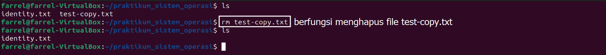
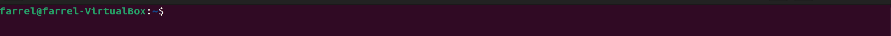
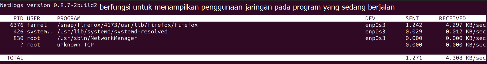
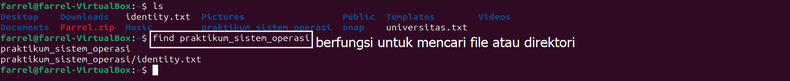

# Ahmad Farrel Aly 09011282328045 SK3C

# Daftar 50 Command Yang digunakan Linux
1. whoami 
2. pwd 
3. ls 
4. mkdir 
5. cd 
6. nano 
7. cat 
8. cp 
9. mv 
10. rm 
11. rmdir 
12. echo 
13. ping 
14. sudo 
15. grep 
16. cal 
17. date 
18. top  
19. shutdown 
20. clear  
21. touch 
22. whereis 
23. whatis 
24. passwd 
25. reboot 
26. diff 
27. head 
28. tail 
29. kill 
30. ifconfig 
31. zip 
32. unzip 
33. nethogs  
34. apt-get update 
35. history 
36. free 
37. help 
38. uname 
39. netstat 
40. chmod 
41. lscpu 
42. uptime 
43. traceroute 
44. curl 
45. find 
46. man  
47. alias 
48. unalias 
49. wc 
50. exit 
